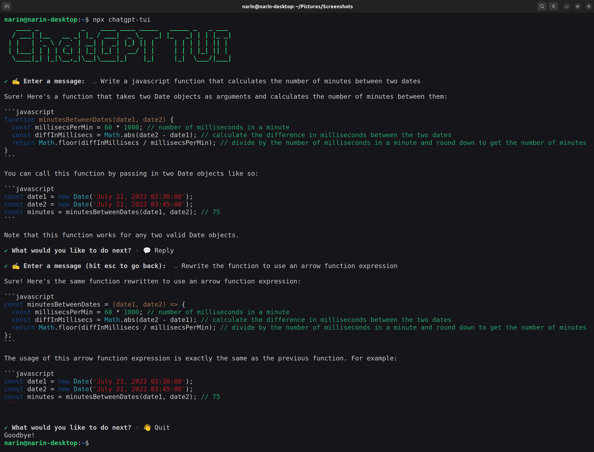
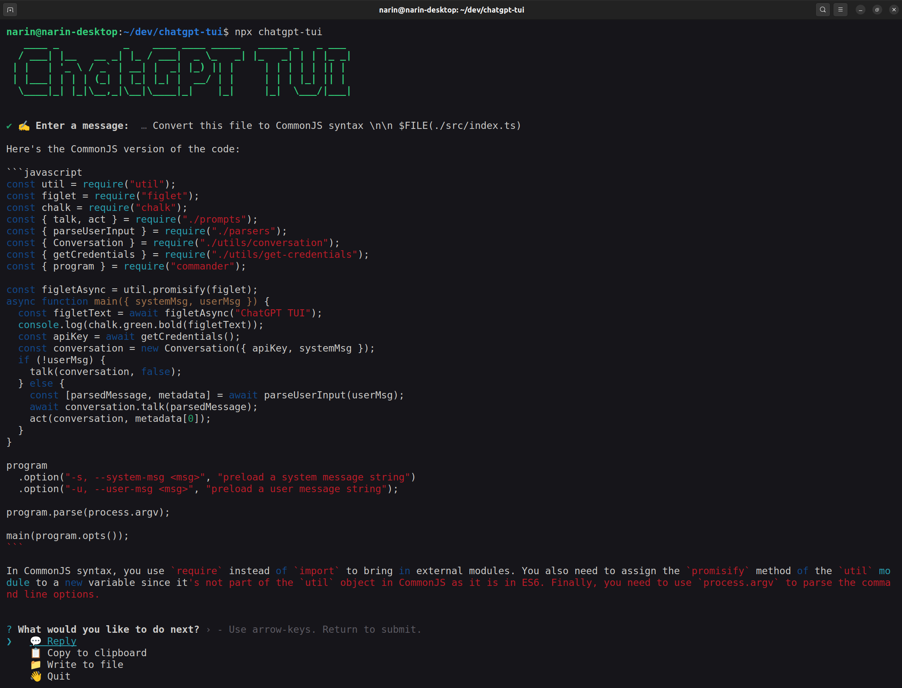
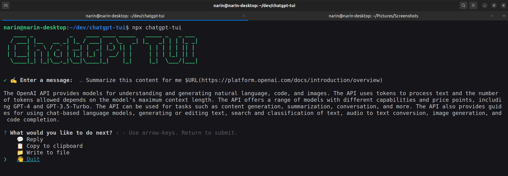

# ChatGPT-TUI

A terminal user interface for ChatGPT with an empasis on importing/exporting code (no more copy/pasting!).



Features:

- 🖨️ Export code blocks to files or copy to clipboard
- 💾 Load code from files and insert into the conversation
- 🌎 Load content from websites (i.e. documentation) and insert into the conversation
- ✒️ Syntax highlighting for code blocks

## Why not just use GitHub Copilot?

You should! But one missing feature is the ability to iterate on a solution. For non-trivial problems, its unlikely that the first solution it comes up with is correct. Having the model ["think step by step"](https://github.com/openai/openai-cookbook/blob/main/techniques_to_improve_reliability.md#techniques-to-improve-reliability) can dramatically improve its abilities on complex tasks. With ChatGPT-TUI, you can iterate on your solution and export it to a file (without all the copy/pasting).

## Quick Start

To install and run, simply type the following into your terminal:

```
npx chatgpt-tui
```

If this is your first time running the program, it will prompt you for your OpenAI API key.
After you've created an OpenAI account, you can get one [here](https://platform.openai.com/account/api-keys).

From there, you can start chatting with ChatGPT, much like you would with the [ChatGPT website](https://chat.openai.com/).

## Loading Local Files

You can load local files into the conversation by using the `$FILE(<path>)` syntax. For example, if you wanted to load the contents of `./src/index.ts` into the conversation, you would do:

```
The contents of ./src/index.ts are: \n\n $FILE(./src/index.ts)
```



To load specific lines of a file (as opposed to the entire thing), add brackets after the path but before the closing parenthesis. For example, to load lines 1-5 of `./src/index.ts`, you would do:

```
This will load the first 5 lines of ./src/index.ts \n\n $FILE(./src/index.ts[1-5])
```

To load an entire directory, you can use the `$FOLDER(<path>)` syntax. Note, this is not reccomended because you will likely exceed the token limit.

## Loading Content from Websites (experimental!)

You can load content from websites into the conversation by using the `$URL(<url>)` syntax. For example, if you wanted to load the contents of [the OpenAI documentation](https://beta.openai.com/docs/) into the conversation, you would do:



This feature is still a work in progress, bugs are expected.

## CLI Options

### `--user-msg`

Preload the first message you type. When combined with some bash scripting, this can be used to automate the refactoring of multiple files, especially when the refactoring is non-trivial (i.e. hard to solve with a simple codegen)

For instance, to convert all the files in `./src` to use ES6 modules, you could do:

```bash
for file in ./src/\*; do
npx chatgpt-tui --user-msg "Refactor this code to use ES6 modules $file \n\n \$FILE($file)"
done
```

Notice we had to escape the second `$` character in the user message. This is because bash will try to perform variable substitution, which we don't want, because we want it to be interpreted by ChatGPT-TUI.

## Future Features

I hacked this together in a few days, so it's not very polished. Here are some features I plan to add:

### Support exporting multiple code blocks

Currently, the user has to select each code block individually to write to a file. I'd like to add a feature to export all code blocks at once.

### Add CLI options

#### `--debug`

Should print out the user message post transformations (i.e. after `$FILE` substitutions are made).

#### `--log-dir`

Should log the entire conversation to a directory.

#### `--model`

Right now, we use the "gpt-3.5-turbo-0301" model. If some users have access to GPT4, they were greatly benefit from using that model.
